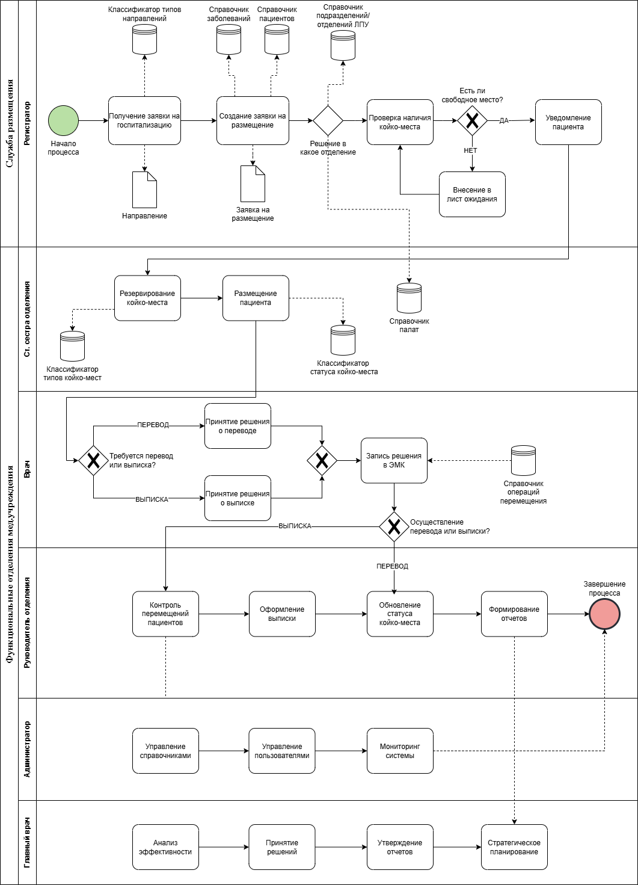

# Информационная система управления больницей | Hospital Management Information System

> База данных для управления размещением пациентов в медицинском учреждении

---

## Описание проекта

Информационная система для автоматизации процессов размещения пациентов в стационаре медицинского учреждения. Система управляет койко-местами, направлениями на госпитализацию, размещением пациентов и формированием отчетности.

### Основные возможности:
- Учет и управление койко-местами в отделениях
- Регистрация пациентов и их размещение
- Обработка направлений на госпитализацию
- Отслеживание статуса койко-мест 
- Формирование отчетов по загруженности отделений

---

## Структура базы данных

### Основные таблицы:

**1. Отделения (Departments)**
- Хранит информацию об отделениях больницы
- Поля: ID отделения, название, тип отделения

**2. Палаты (Wards)**
- Информация о палатах в отделениях
- Поля: ID палаты, номер палаты, ID отделения, вместимость

**3. Койко-места (Beds)**
- Учет всех койко-мест
- Поля: ID койки, номер койки, ID палаты, тип койки, статус

**4. Пациенты (Patients)**
- Личные данные пациентов
- Поля: ID пациента, ФИО, дата рождения, контакты

**5. Направления (Referrals)**
- Направления на госпитализацию
- Поля: ID направления, ID пациента, тип направления, дата, диагноз

**6. Госпитализации (Hospitalizations)**
- История размещения пациентов
- Поля: ID госпитализации, ID пациента, ID койки, даты поступления/выписки, диагноз

**7. Справочники:**
- Типы направлений
- Справочник заболеваний (МКБ-10)
- Типы койко-мест

---

## Диаграмма процесса

Проект включает BPMN-диаграмму бизнес-процесса "Служба размещения", которая описывает:
- Получение заявки на госпитализацию
- Создание заявки на размещение
- Проверку наличия койко-мест
- Размещение пациента
- Формирование отчетов



---

## Технологии

- **СУБД**: PostgreSQL / MySQL
- **Язык запросов**: SQL
- **Диаграммы**: Draw.io (BPMN 2.0)

---

## Примеры SQL запросов

### 1. Поиск свободных койко-мест в отделении

```sql
SELECT 
    d.department_name AS "Department",
    w.ward_number AS "Ward Number",
    b.bed_number AS "Bed Number",
    bt.type_name AS "Bed Type",
    b.status AS "Status"
FROM 
    beds b
JOIN wards w ON b.ward_id = w.ward_id
JOIN departments d ON w.department_id = d.department_id
JOIN bed_types bt ON b.bed_type_id = bt.bed_type_id
WHERE 
    b.status = 'available'
    AND d.department_name = 'Therapeutic Department'
ORDER BY 
    w.ward_number, b.bed_number;
```

### 2. Список текущих госпитализаций с информацией о пациентах

```sql
SELECT 
    p.last_name || ' ' || p.first_name || ' ' || COALESCE(p.middle_name, '') AS "Patient Name",
    d.department_name AS "Department",
    w.ward_number AS "Ward Number",
    b.bed_number AS "Bed Number",
    h.admission_date AS "Admission Date",
    h.expected_discharge_date AS "Discharge Date",
    h.diagnosis AS "Diagnosis"
FROM 
    hospitalizations h
JOIN patients p ON h.patient_id = p.patient_id
JOIN beds b ON h.bed_id = b.bed_id
JOIN wards w ON b.ward_id = w.ward_id
JOIN departments d ON w.department_id = d.department_id
WHERE 
    h.discharge_date IS NULL
ORDER BY 
    d.department_name, w.ward_number;
```

### 3. Статистика по типам направлений

```sql
SELECT 
    rt.type_name AS "Referral Type",
    COUNT(r.referral_id) AS "Number of Referrals",
    MIN(r.referral_date) AS "First Referral",
    MAX(r.referral_date) AS "Last Referral"
FROM 
    referral_types rt
LEFT JOIN referrals r ON rt.referral_type_id = r.referral_type_id
GROUP BY 
    rt.type_name
ORDER BY 
    COUNT(r.referral_id) DESC;
```

### 4. Отчет по загруженности отделений

```sql
SELECT 
    d.department_name AS "Department",
    COUNT(b.bed_id) AS "Total Beds",
    SUM(CASE WHEN b.status = 'occupied' THEN 1 ELSE 0 END) AS "Occupied",
    SUM(CASE WHEN b.status = 'available' THEN 1 ELSE 0 END) AS "Available",
    ROUND(100.0 * SUM(CASE WHEN b.status = 'occupied' THEN 1 ELSE 0 END) / COUNT(b.bed_id), 1) AS "Occupancy %"
FROM 
    departments d
JOIN wards w ON d.department_id = w.department_id
JOIN beds b ON w.ward_id = b.ward_id
GROUP BY 
    d.department_name
ORDER BY 
    "Occupancy %" DESC;
```

---

## Структура проекта

```
hospital_database/
│
├── README.md                    # Документация проекта
├── schema.sql                   # Схема базы данных (CREATE TABLE)
├── sample_data.sql              # Тестовые данные
├── queries.sql                  # Коллекция SQL запросов
├── ER_diagram.png               # ER-диаграмма / BPMN процесс
```

---

## Как развернуть проект

### Требования:
- PostgreSQL 12+ или MySQL 8+
- Клиент для работы с БД (DBeaver, pgAdmin, MySQL Workbench)

### Установка:

1. **Создайте базу данных:**
```sql
CREATE DATABASE hospital_db;
```

2. **Выполните скрипт создания схемы:**
```bash
psql -d hospital_db -f schema.sql
```

3. **Загрузите тестовые данные:**
```bash
psql -d hospital_db -f sample_data.sql
```

4. **Выполните тестовые запросы:**
```bash
psql -d hospital_db -f queries.sql
```

---

## Бизнес-процесс "Служба размещения"

### Этапы процесса:

1. **Получение заявки** — регистратор получает направление на госпитализацию
2. **Создание заявки на размещение** — формируется заявка с указанием диагноза и требований
3. **Выбор отделения** — определение подходящего отделения по профилю заболевания
4. **Проверка наличия мест** — поиск свободных койко-мест в выбранном отделении
5. **Размещение пациента** — назначение койко-места и регистрация госпитализации
6. **Уведомление пациента** — информирование о размещении или постановке в очередь
7. **Выписка и освобождение места** — обновление статуса койки после выписки

---

## Навыки, продемонстрированные в проекте

- Проектирование реляционных баз данных
- Нормализация данных (3НФ)
- SQL запросы (SELECT, JOIN, GROUP BY, подзапросы)
- Агрегатные функции и аналитика
- Моделирование бизнес-процессов (BPMN)
- Работа со справочниками и классификаторами
- Проектирование информационных систем для здравоохранения

---

## Лицензия

MIT License - проект доступен для использования в образовательных целях.
